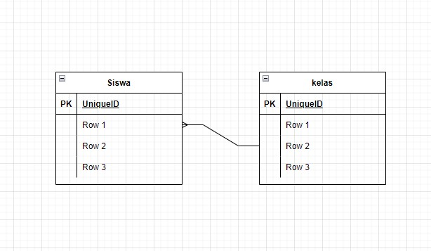

# Database

## MySQL

Buatlah sebuah database `sekolah` yg di dalamnya terdapat informasi terkait kelas dan Ekstrakurikuler yg di ikuti oleh siswa.

Siswa hanya terdaftar pada 1 kelas saja, dan siswa dapat mengikuti banyak Ekstrakurikuler

### Tugas mu adalah:

- Design database
  - Tentukan entitynya
  - Tentukan relasinya
  - Buat design di Google diagram
  - Simpan design dengan nama `design-database.jpg`
- Buat database
  - Membuat table
  - Menginput data
  - Menampilkan data pada masing-masing table
  - Menampilkan data menggukan join
  - Simpan semua perintah (script) pada file `sekolah.sql`

### Format pengumpulan

Tugas seperti biasa dikumpulkan ke github, yg di dalamnya terdapat file berikut

```
  - design-database.jpg
  - sekolah.sql
```

## contoh
`design-database.jpg`




`sekolah.sql`

```sql
-- Show Database --
SHOW DATABASES;

-- Create Database --
CREATE DATABASE sekolah;

-- Insert Data --
INSERT INTO siswa (id, name, age) VALUES(1, 'Terra', 2);
```
